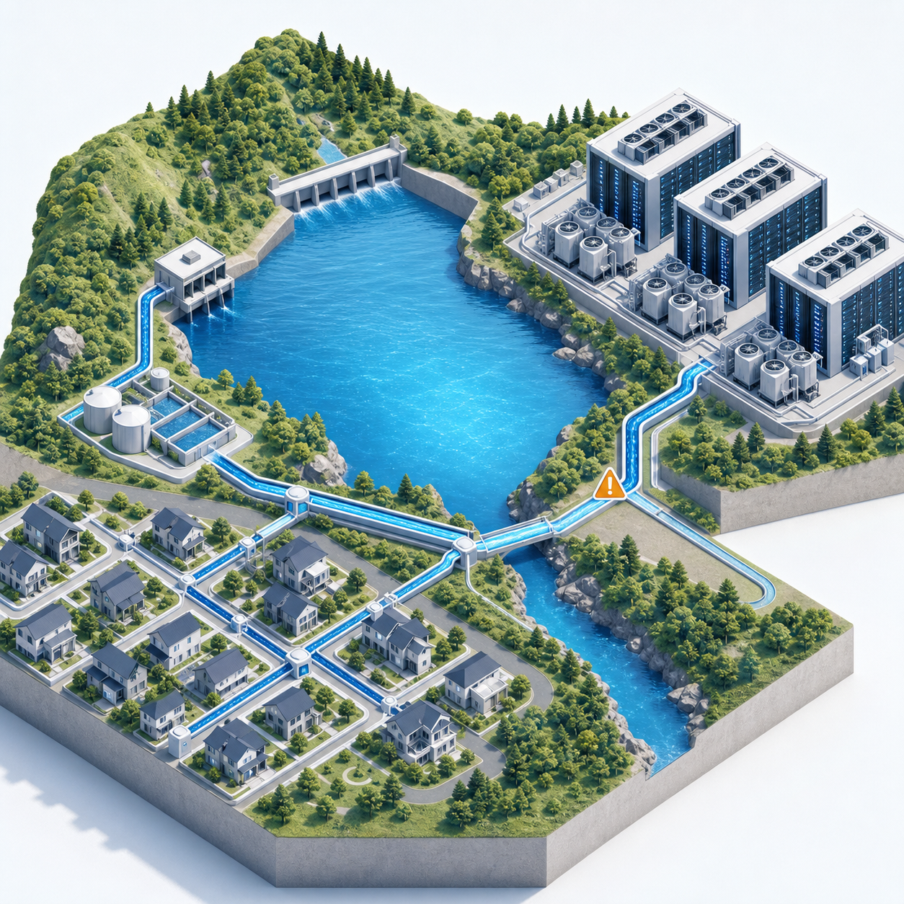

# Water Negotiation Lab



データセンター集中が地域の飲用可能な上水へ与える追加負荷を、決定論的な水収支と、意思決定だけを行うローカルLLMエージェントで検証するシミュレーターです。主な比較期間は2026年6月1日〜9月10日の102日間で、千葉県印西市・千葉ニュータウンの公表情報を文脈として使う合成プロファイルと、完全合成のMVPプロファイルを用意しています。2026年9月10日は成果物作成時点より後なので、画面の降水と広域貯水には、完結している2025年の同じ月日を観測コンテキストとして併記します。2025年の値は2026年の実績や予報ではなく、水収支の流入・配分にも使用しません。

> **重要:** 本プロジェクトは仮説生成用であり、現実の水不足や施設影響を予測するものではありません。公表値は基準層として限定利用し、配水容量、供給余裕、将来渇水、データセンター仕様などは明示した仮定値です。結果を政策判断、立地判断、投資判断に利用しないでください。

## 何が新しいか

- 水量はPythonだけが計算し、LLMへ計算させない
- 「データセンターなし」を同じ条件で走らせ、住民の**追加不足量**を反実仮想差として計算
- 取水、蒸発による消費、ブローダウン、地域返流水、回収可能排水を別々に記録
- 再生水インフラなしの`0%`を基準に、`2%`、`25%`、`50%`を感度分析
- 住民優先と比例配分、単独施設と複数集中、合成基準供給と合成渇水ストレス、配水池増設、敷地内水槽を比較
- 4役の全プロンプト、未加工応答、JSON解析、検証結果をJSONLへ保存
- Pythonが計算した系列だけを表示する、ゲーム風のインタラクティブ画面を生成

## デモで見る結論

夏季〜初秋102日・合成基準供給・再生水0%という**仮定シナリオ**では、既存住民だけのケースに不足は発生しません。単一施設・D31稼働・稼働率80%・WUE 1.1 L/kWh・比例配分という条件だけを固定してIT負荷を反復計算すると、住民不足は約124.7 MWから発生し始めます。250 MWでは配水バッファが39日目（7月9日）に空になり、住民累積不足は153.53 MLです。この閾値は一般値や現実予測ではなく、この102日モデル固有の感度結果です。

| 仮定シナリオ | DC上水消費量 | 配水バッファ | 住民累積不足 |
|---|---:|---:|---:|
| DCなし | 0 ML | 期間内は枯渇せず | 0 ML |
| 40 MW・住民優先 | 42.58 ML | 期間内は枯渇せず | 0 ML |
| 3施設・合計105 MW | 83.26 ML | 期間内は枯渇せず | 0 ML |
| 250 MW・住民優先 | 132.68 ML | 39日目に空 | 0 ML（DC側を制限） |
| 250 MW・比例配分 | 240.15 ML | 39日目に空 | 153.53 ML／64日 |

ここでの「上水消費量」は、実取水のうち蒸発等で即時利用できない量です。250 MWは実在施設の公表値ではなく、関係性を可視化するためのストレス感度です。地域配水バッファの容量には、令和6年度事業年報にある北総浄水場配水池の有効容量48,000 m³（48 ML）を代理値として使い、6月1日に満水で始まると仮定します。48 MLは印西市専用の容量ではなく、満水開始も観測事実ではありません。基準供給量、月別需要形状、渇水倍率、施設値も合成仮定です。

画面へ併記する我孫子アメダスの2025年6月1日〜9月10日の日降水量は期間合計394.5 mmで、利根川上流9ダムは2025年の10日ごとの確定値です。どちらも観測コンテキストであり、`source_inflow_l`や配分可能量へ変換しません。我孫子の雨は上流ダム流域の雨ではなく、9ダム全量も北総浄水場や印西市へ割り当てられた水ではありません。根拠と仮定の区別は[公的資料](docs/sources.md)と[仮定値](docs/assumptions.md)にあります。

日次計算は「日初の一括流入→容量超過の溢水→当日需要の配分」という時間順序です。日内順序は結果へ影響するモデル仮定ですが、上表はすべて同じ順序で再計算した夏季102日出力です。旧365日版で行った代替順序の感度値は夏季結果へ流用していません。境界の詳細は[モデル境界](docs/model-boundaries.md)に固定しています。

## 環境構築

必要なのはGit、macOS／Linux／WSLのPOSIX `sh`互換シェル、Python 3.11以降です。Pythonの外部パッケージはなく、仮想環境の作成や`pip install`は不要です。

```bash
git clone https://github.com/torikizi/water-datacenter-source.git
cd water-datacenter-source
python3 --version
```

`python3 --version`が3.11以降であることを確認してください。

## 3分で動かす

```bash
./scripts/run_tests.sh
./scripts/run_comparison.sh
./scripts/run_agent_season.sh
./scripts/run_game.sh outputs/inzai-water-game.html outputs/agent-summer
```

テストの末尾に`OK`が表示され、生成された`outputs/inzai-water-game.html`をブラウザーで開ければ最短手順は完了です。画面上の比較は`データセンターなし`と`データセンターあり`の2ケースだけです。DCありでは設備IT負荷を40〜300 MWの18段階から、スライダーまたはプルダウンで選べます。IT電力量、冷却用水需要、住民向け上水の減少、最初の不足日が連動し、固定条件では`124.6 MWまで不足なし`、`124.7 MWから不足開始`を並べて表示します。境界付近の124.6／124.7／125 MWを含む全表示点はPython水収支モデルで事前計算され、JavaScriptは結果を切り替えて整形するだけです。DCなしは住民・水道・自治体の3者、DCありはDC事業者を加えた4者の論点を計算値連動のルール表示で整理します。この論点表示はLLM発言ではなく、実LLMの未加工会議ログはJSONL成果物で別に監査できます。

任意の監査済み実行を明示的に埋め込む場合は、第2引数へそのディレクトリを渡します。

```bash
./scripts/run_game.sh outputs/inzai-water-game.html /path/to/audited-agent-run
```

4役のエージェント連携を再現可能なモックで確認する場合:

```bash
./scripts/run_demo.sh
```

6月1日〜9月10日の102日を毎日計算し、14日ごとの定期会議と危険水位・不足開始時の臨時会議を行うデモ:

```bash
./scripts/run_agent_season.sh
```

この設定は最大12会議で、現在の固定モック出力は10会議・4役×10回＝40判断です。毎日の水量計算とLLM判断の頻度を分離し、会議で決まった固定制限を翌日から継続します。生成される`agent-council.html`では、会議日、4者の判断、翌日の上限・貯水・DC不足を同じタイムラインで確認できます。固定モックではD35（7月5日）の制限決定がD36から有効になり、制限なしの同一250 MWケースと比べてD36のDC取水を1,320 kL減らし、地域配水バッファが空になる日をD39からD41へ遅らせました。

2026年8月29日に同じ夏季条件を実DS4でも監査し、10会議・40応答すべてが厳密JSONスキーマに合格しました。正規化・フォールバックは0件で、実DS4の自治体もD35に制限を決め、PythonがD36から固定倍率75%を適用しました。この監査は生ログとして保存し、提出用ゲームの主画面はLLM表示ではなく、DCなし／ありとIT負荷の物理的な差に絞っています。

提出用の生ログ、解析データ、グラフ、ゲーム画面をまとめて再生成する場合:

```bash
./scripts/build_submission_artifacts.sh
```

第1引数で別の出力先を指定できます。夏季実DS4監査`submission_artifacts/ds4_agent_summer_demo_v3`があれば既定で埋め込み、まだなければ明示的に「MockProvider」と表示する再現用夏季モックでプレビューを生成します。任意の監査実行を使う場合は第2引数で指定します。旧`ds4_agent_season_demo_v2`は365日・2026年8月26日開始の履歴アーカイブで、夏季版ゲームを駆動しません。

```bash
./scripts/build_submission_artifacts.sh /tmp/water-lab-submission /path/to/audited-agent-run
```

出力先を変える場合は各スクリプトの第1引数に指定できます。

```bash
./scripts/run_comparison.sh /tmp/water-lab-comparison
```

## アーキテクチャ

```text
TOML設定
  ├─ Python水収支エンジン ── 日別の取水・消費・返流・貯水・不足
  │                         └─ JSONL / JSON / SVG / ゲーム画面
  └─ エージェント実行層 ─── 数値状態 + 履歴 + 役割目的
                              └─ Mock または外部DS4 → 短いJSON判断
```

Pythonは需要、供給、貯水、施設内水用途、不足、反実仮想差を確定します。LLMは許可された`action`を選び、`message`と`reason`を返すだけです。LLMが出した数値や説明を事実として採用しません。応答はスキーマ検証し、失敗時は`no_action`へ置き換えます。

JSON構造、必須キー、許可`action`、文字列型の違反は引き続き`no_action`です。一方、構造が正しい応答の`message`または`reason`だけが240文字を超えた場合は、Pythonが240文字へ決定論的に短縮して`action`を保持します。未加工応答、元文字数、短縮後文字数はJSONLへ別々に保存し、1,024文字を超える異常長は短縮せず拒否します。

4役は住民代表、水道事業者、データセンター事業者、自治体です。会議では先に3者が状態認識と要求を提示し、自治体が同じ会議の3発言を読んで最後に政策を決定します。自治体の制限行動が有効になっても、効果は設定済みの固定倍率を翌日から適用するだけで、LLMが水量や倍率を決定することはありません。

## DS4（DwarfStar）接続

DS4は同梱せず、OpenAI互換の外部サーバーとして交換可能な`LLMProvider`から接続します。[DS4公式README](https://github.com/antirez/ds4)で2026-08-27時点の仕様を確認した設定は次の通りです。

- Base URL: `http://127.0.0.1:8000/v1`
- Endpoint: `POST /v1/chat/completions`
- Model: `deepseek-v4-flash`
- `temperature: 0`、`max_tokens: 300`、`stream: false`
- `thinking: {"type": "disabled"}`

DS4サーバーを別途起動した後だけ、短時間の実行を行います。

```bash
./scripts/run_ds4_smoke.sh
```

この疎通設定は4役×1日＝4回だけ推論し、`submission_artifacts/ds4_agent_demo`へ実応答を保存します。必要な場合だけ`DS4_API_KEY`を参照します。DS4のインストール、巨大モデルの取得、サーバー起動、長時間推論は自動化していません。モックログと実DS4ログは出力先を分けます。

夏季デモを実DS4で生成するスクリプトも用意していますが、最大48回の推論を行うため通常の成果物生成からは除外しています。2026年8月29日の監査では10会議・40回を実行し、40件すべてが厳密JSONスキーマに合格、正規化・フォールバックは0件でした。再実行時も、外部DS4を起動し、実行時間を確認したうえで明示的に実行します。

```bash
./scripts/run_ds4_agent_season.sh
```

## 出力と公開サンプル

単一シナリオ:

- `water_balance.jsonl`: 1日1行の全水収支と施設別内訳
- `llm_messages.jsonl`: プロンプト、未加工応答、解析結果、検証エラー
- `summary.json`: 累積供給・不足・取水・消費、設定の完全な写し
- `scenario_metrics.svg`: 貯水、住民供給・不足、施設上水取水

比較実行:

- `comparison_summary.json`: 全比較ケースの反実仮想指標
- `scenario_comparison.csv`: 審査・追加解析用の平坦な表
- `storage_comparison.svg`: 夏季版では合成した地域配水バッファ（広域水源層を有効にした設定では別パネルも表示）
- `resident_supply_shortage.svg`: 住民供給と累積不足
- `datacenter_potable_use.svg`: DCの上水取水・消費
- 各シナリオ配下の`water_balance.jsonl`、`summary.json`、`llm_messages.jsonl`

夏季102日の決定論プレビューは[submission_artifacts/summer_preview](submission_artifacts/README.md)にあります。比較実行は水収支だけを隔離するためLLMを呼ばず、`llm_messages.jsonl`は空です。再現用の夏季モック40件、実DS4疎通4件、実DS4夏季監査40件をそれぞれ別ディレクトリへ保存しています。夏季実監査の正本は`submission_artifacts/ds4_agent_summer_demo_v3`です。既存の365日実DS4監査は履歴アーカイブとして別ディレクトリに保持し、夏季の物理系列やゲーム入力には使用しません。

実DS4夏季監査では、住民・水道・DCの同一会議発言を読んだ自治体がD35に制限を決定し、D36から上限75%が有効になりました。制限なしの同一250 MW反実仮想に対し、D36のDC取水は1.32 ML減り、最大貯水差は3.96 ML、配水バッファ枯渇はD39からD41へ2日遅延しました。住民不足は両ケースとも0で、制限ケースのDC不足は累積190.61 ML／67日です。D71、D85、D99にも会議があり、貯水率0%で解除基準55%を満たさないため制限継続が選ばれています。これらの水量と反実仮想差はLLMではなくPythonが計算しています。

旧実DS4監査v2は365日版の監査履歴です。3件の長文応答を含む未加工ログと、当時の後続判断を改変せず保存していますが、開始日・日数・物理条件が異なるため夏季102日版へ埋め込めません。夏季実DS4再実行は別監査として保存します。

## 再現性と検証

- 固定seedと決定論的`MockProvider`
- 水量保存則、施設内水収支、広域水源収支
- 貯水量の上下限
- 不足量の非負
- 住民優先／比例配分
- 再生水感度、配水池増設、敷地内水槽
- 観測基準層では既存住民需要を二重に差し引かないこと

```bash
./scripts/run_tests.sh
```

## 設定と用語

主要設定は人口、1人1日需要、貯水容量、日別／月別補給、渇水倍率、DC稼働開始日、IT負荷、稼働率、WUE、上水・再生水比率、蒸発、ブローダウン、返流水、回収可能排水、供給政策、配水池増設、DC敷地内水槽です。

- `datacenter_direct_water_requirement_l`: IT電力量 × WUE
- `datacenter_potable_requirement_l`: 直接水需要 × 上水使用率。必要量であり実取水とは別
- `datacenter_potable_withdrawal_l`: 地域から実際に供給された上水取水量
- `datacenter_potable_consumptive_use_l`: 上水取水のうち蒸発等で即時利用できない量
- `datacenter_regional_return_l`: 地域水系へ戻ると仮定した量。同日の地域貯水へは戻さない
- `reservoir_commissioning_fill_l`: 配水池供用時の外部初期充水。流入として記録
- `regional_source_incremental_dc_consumptive_use_l`: 広域水源層を有効にした場合に基準から差し引くDC上水消費。夏季版では診断値だけを記録し、観測貯水系列からは差し引かない
- `observed_precipitation_mm`: 2025年の我孫子日降水量を同じ月日へ対応させた表示用コンテキスト。上水流入ではない
- `observed_reservoir_reference_storage_l`: 2025年の利根川上流9ダム10日値を表示用に補間した広域コンテキスト。印西向け在庫や配分可能量ではない

式と境界は[モデル境界](docs/model-boundaries.md)、印西プロファイルは[立地資料](docs/location-inzai.md)を参照してください。

## リポジトリ構成

```text
configs/                  印西の混合エビデンス設定
docs/                     公的資料、仮定値、モデル境界、立地説明
examples/                 完全合成の最小設定
scripts/                  実行・検証・提出成果物の再生成
src/water_negotiation_lab/ 独立実装した水収支、エージェント、表示
submission/               提出用の索引、台本、チェックリスト、画像素材
submission_artifacts/     公開用の生ログ、解析表、グラフ、ゲーム画面
tests/                    標準ライブラリだけで動く単体テスト
```

## 公的統計と仮定値

令和4年度は全国の下水処理水が約145億m³/年で、場外利用された再生水は約2.4億m³/年、割合は2%未満でした。場外供給処理場は475／2,133か所です。確認した資料では、国内データセンター専用の再生水利用量の全国集計は特定できませんでした。このため基準ケースは`reclaimed_water_share = 0.0`です。2%はDC実績値ではなく低利用感度点、25%と50%は専用インフラがある反実仮想です。

公的資料と観測値は[docs/sources.md](docs/sources.md)、合成値と仮定値は[docs/assumptions.md](docs/assumptions.md)へ分離しています。

## 独立実装と関連研究

ローカルモデル、数値状態、限定履歴、監査可能ログ、仮説生成という設計上の関連研究として[Hyodo, arXiv:2608.22833](https://arxiv.org/abs/2608.22833)を参照しています。本プロジェクトは同論文に関連するリポジトリやSD-AgentFoundryのコード、README、設定形式、プロンプト、画像、名称を使用・コピーしていません。水収支エンジン、エージェント境界、設定スキーマ、ログ形式、ゲーム画面を新規に実装しています。

参考資料、外部ランタイム、公的データ、画像とコードの来歴は[CREDITS.md](CREDITS.md)に一覧化しています。資料を「参考にしたこと」と、第三者コードを「同梱・派生したこと」を明確に分けています。詳細な数値根拠と基準日は引き続き[docs/sources.md](docs/sources.md)を正本とします。

## 現在の限界

- 再生水ケースは、指定比率を満たす外部供給と配管が存在する感度分析上の仮定
- 水質、料金、法的優先順位、環境流量、送配水損失、住民排水の再利用は未モデル化
- 地域返流水と回収可能排水は記録するが、同日に地域貯水へ循環させない
- WUE、IT負荷、施設内水用途比率、印西専用配水容量は実施設値ではない
- 北総浄水場配水池48 MLは複数地域へ給水する施設の公表容量であり、印西専用在庫ではない。モデルで満水開始の地域バッファ代理値とする部分は仮定
- 2025年の我孫子日降水量と利根川上流9ダム10日値は画面・ログの観測コンテキストだけに使い、2026年の流入、配分、天候予報には使わない
- 北総系の水源には利根川河口堰、川治ダム、湯西川ダム、奈良俣ダムが関係する一方、9ダム系列に含まれるのはこのうち奈良俣ダムだけで、北総系統全体を表さない
- 通常条件の基準供給と渇水倍率はいずれも合成仮定で、2025年または2026年の天候再現ではない
- LLM交渉は短い逐次メッセージで、現実の制度手続きや合意形成を完全には表現しない

## ライセンスとクレジット

Copyright 2026 torikizi

本プロジェクトは[Apache License 2.0](LICENSE)で公開します。帰属表示は[NOTICE](NOTICE)、設計上の関連研究、公的データ、外部ランタイム、同梱物の来歴は[CREDITS.md](CREDITS.md)を参照してください。

## 提出資料

- [提出パッケージ索引](submission/README.md)
- [デモ動画台本](submission/demo-script.md)
- [提出前チェックリスト](submission/checklist.md)

4枚説明スライドとデモ動画はリポジトリへ含めず、提出時に外部共有URLを登録します。
